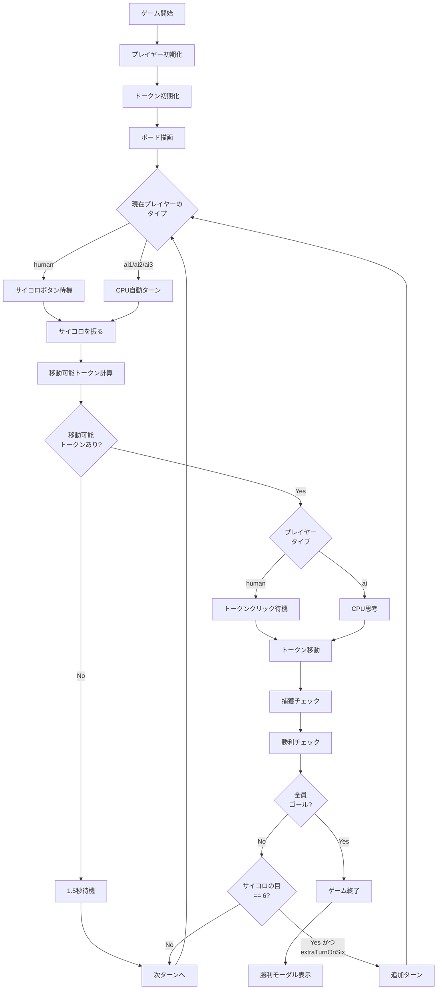

# ルドーゲーム 詳細設計書

## ドキュメント管理

### バージョン情報
- **バージョン**: v1.0
- **最終更新日**: 2026年1月14日
- **作成者**: Development Team

### 変更履歴
| バージョン | 日付 | 変更内容 |
|:---:|:---|:---|
| v1.0 | 2026/01/14 | 初版作成 - データ構造定義を追加 |

### 文書の目的
本ドキュメントは、ルドーゲーム（ludo.js）の実装における詳細設計を定義します。変数名、データ構造、処理ロジック、アルゴリズムを明確化し、コードの保守性と拡張性を確保することを目的とします。

---

## 1. データ構造定義

### 1.1 グローバル定数

#### 1.1.1 色関連定数

```javascript
// ゲームで使用する色の配列
const COLORS = ['red', 'blue', 'yellow', 'green'];
```
- **型**: `Array<string>`
- **値**: `['red', 'blue', 'yellow', 'green']`
- **用途**: プレイヤーの色を識別する標準配列。配列インデックスがプレイヤー番号に対応
- **使用箇所**: プレイヤー初期化、トークン管理、UI描画

```javascript
// 色名の日本語表示マッピング
const COLOR_NAMES = { red: '赤', blue: '青', yellow: '黄', green: '緑' };
```
- **型**: `Object<string, string>`
- **値**: `{ red: '赤', blue: '青', yellow: '黄', green: '緑' }`
- **用途**: UIでの色名表示（ログ、ステータス表示）
- **使用箇所**: ログ出力、ターン表示、勝利モーダル

#### 1.1.2 ゲーム盤面定数

```javascript
// 各プレイヤーが持つトークン数
const TOKENS_PER_PLAYER = 4;
```
- **型**: `number`
- **値**: `4`
- **用途**: トークンの初期化、勝利判定
- **不変性**: ゲーム中は変更不可

```javascript
// ボードのサイズ（行列数）
const BOARD_SIZE = 11;
```
- **型**: `number`
- **値**: `11`
- **用途**: ボード描画、座標計算
- **説明**: 11×11マスの正方形ボード

```javascript
// メインパスの長さ（円形通路）
const PATH_LENGTH = 40;
```
- **型**: `number`
- **値**: `40`
- **用途**: トークン位置の正規化（`position % PATH_LENGTH`）
- **説明**: 全プレイヤーが共有する円形通路の総マス数

```javascript
// ホームパスの長さ（ゴールへの最終通路）
const HOME_PATH_LENGTH = 4;
```
- **型**: `number`
- **値**: `4`
- **用途**: ホームパス座標計算、ゴール判定
- **説明**: 各色専用のゴールまでの直線通路

```javascript
// セーフマスの配列
const SAFE_POSITIONS = [];
```
- **型**: `Array<number>`
- **値**: `[]`（空配列）
- **用途**: 捕獲判定での除外処理
- **説明**: この実装ではセーフマスは存在しない（全マスで捕獲可能）

#### 1.1.3 スタート位置定数

```javascript
const START_POSITIONS = {
    red: 0,      // パス配列位置0（ボード座標: row=4, col=0）
    blue: 10,    // パス配列位置10（ボード座標: row=0, col=6）
    yellow: 20,  // パス配列位置20（ボード座標: row=6, col=10）
    green: 30    // パス配列位置30（ボード座標: row=10, col=4）
};
```
- **型**: `Object<string, number>`
- **キー**: 色名（'red', 'blue', 'yellow', 'green'）
- **値**: パス配列上の位置（0-39）
- **用途**: ベースからトークンを出す際の初期配置位置、捕獲後の戻り先
- **関係性**: 各色のスタート位置は10マスずつずれている（360度÷4色＝90度）

---

### 1.2 ゲーム状態オブジェクト（gameState）

```javascript
let gameState = {
    playerCount: 4,              
    playerCountSelected: false,  
    players: [],                 
    currentPlayerIndex: 0,       
    diceValue: null,             
    tokens: {},                  
    settings: {
        requireSixToStart: true,
        extraTurnOnSix: true,
        exactRollToFinish: true,
        cpuThinkingTime: true
    },
    isRolled: false,             
    movableTokens: [],           
    gameStarted: false,          
    winners: [],                 
    turnCount: 0                 
};
```

#### 1.2.1 プレイヤー関連プロパティ

##### `playerCount`
- **型**: `number`
- **初期値**: `4`
- **範囲**: `2`, `3`, `4`
- **用途**: 参加プレイヤー数
- **変更タイミング**: ゲーム開始前の設定画面で変更
- **使用箇所**: プレイヤー初期化、UI生成

##### `playerCountSelected`
- **型**: `boolean`
- **初期値**: `false`
- **用途**: プレイヤー人数選択済みフラグ
- **変更タイミング**: 人数ボタンクリック時に`true`に変更
- **使用箇所**: UI表示制御

##### `players`
- **型**: `Array<PlayerObject>`
- **初期値**: `[]`
- **構造**: 以下のPlayerObjectの配列
```javascript
{
    color: 'red' | 'blue' | 'yellow' | 'green',  // プレイヤーの色
    type: 'human' | 'ai1' | 'ai2' | 'ai3'         // プレイヤータイプ
}
```
- **用途**: 各プレイヤーの基本情報を保持
- **要素数**: `playerCount`と一致
- **変更タイミング**: ゲーム開始時に初期化

##### `currentPlayerIndex`
- **型**: `number`
- **初期値**: `0`
- **範囲**: `0` ～ `playerCount - 1`
- **用途**: 現在のターンのプレイヤーを特定
- **変更タイミング**: `nextTurn()`関数で循環的にインクリメント
- **計算式**: `(currentPlayerIndex + 1) % playerCount`

#### 1.2.2 サイコロ関連プロパティ

##### `diceValue`
- **型**: `number | null`
- **初期値**: `null`
- **範囲**: `1` ～ `6` または `null`
- **用途**: 現在のサイコロの目を保持
- **変更タイミング**: `performDiceRoll()`実行時に1-6のランダム値を設定
- **null条件**: サイコロを振る前、または次のターンに移行時

##### `isRolled`
- **型**: `boolean`
- **初期値**: `false`
- **用途**: 現在のターンでサイコロを振ったかのフラグ
- **用途詳細**: 二重クリック防止、CPU自動実行制御
- **変更タイミング**: 
  - `true`: サイコロ実行時
  - `false`: ターン終了時

##### `movableTokens`
- **型**: `Array<TokenIdentifier>`
- **初期値**: `[]`
- **構造**:
```javascript
{
    color: 'red' | 'blue' | 'yellow' | 'green',  // トークンの色
    id: 0 | 1 | 2 | 3                             // トークン番号
}
```
- **用途**: 現在のサイコロの目で動かせるトークンのリスト
- **計算タイミング**: `calculateMovableTokens()`関数で生成
- **使用箇所**: トークンクリック時の移動可能判定、AI思考、UI強調表示

#### 1.2.3 トークン状態プロパティ

##### `tokens`
- **型**: `Object<string, Array<TokenObject>>`
- **初期値**: `{}`
- **構造**:
```javascript
{
    red: [TokenObject, TokenObject, TokenObject, TokenObject],
    blue: [TokenObject, TokenObject, TokenObject, TokenObject],
    yellow: [TokenObject, TokenObject, TokenObject, TokenObject],
    green: [TokenObject, TokenObject, TokenObject, TokenObject]
}
```
- **用途**: 全プレイヤーの全トークンの状態を管理
- **キー**: 色名（COLORS配列の要素）
- **値**: 4個のTokenObjectの配列

**TokenObjectの詳細構造**:
```javascript
{
    position: number,    // トークンの現在位置
    isFinished: boolean  // ゴール済みフラグ
}
```

**position値の意味**:
| 値の範囲 | 意味 | 説明 |
|---------|------|------|
| `-1` | ベース（出発前） | トークンが初期位置にいる状態 |
| `0-39` | メインパス | 円形通路上の位置（PATH_LENGTH基準） |
| `1000-1003` | ホームパス | ゴール手前の専用通路（1000=入口、1003=ゴール） |

**isFinished値**:
- `false`: 通常状態（ベースまたは盤面上）
- `true`: ゴール済み（これ以上移動不可）

#### 1.2.4 設定プロパティ

##### `settings`
- **型**: `Object`
- **用途**: ゲームルールの設定を保持

**settingsオブジェクトの詳細**:

```javascript
{
    requireSixToStart: boolean,    // ベースからの出発に6が必要か
    extraTurnOnSix: boolean,       // 6が出たら追加ターンか
    exactRollToFinish: boolean,    // ゴールに正確な目が必要か
    cpuThinkingTime: boolean       // CPUの思考時間を表示するか
}
```

| プロパティ | 型 | 初期値 | 説明 |
|-----------|-----|-------|------|
| `requireSixToStart` | `boolean` | `true` | `true`: 6の目でのみベースから出られる<br>`false`: 任意の目で出られる |
| `extraTurnOnSix` | `boolean` | `true` | `true`: 6が出たら再度サイコロを振れる<br>`false`: 6でも通常ターン終了 |
| `exactRollToFinish` | `boolean` | `true` | `true`: ゴールにぴったりの目が必要<br>`false`: 超過してもゴール可能 |
| `cpuThinkingTime` | `boolean` | `true` | `true`: CPU思考時にアニメーション表示<br>`false`: 即座に実行 |

#### 1.2.5 ゲーム進行プロパティ

##### `gameStarted`
- **型**: `boolean`
- **初期値**: `false`
- **用途**: ゲーム開始済みフラグ
- **変更タイミング**: `startGame()`関数で`true`に変更
- **使用箇所**: 画面切り替え制御

##### `winners`
- **型**: `Array<WinnerObject>`
- **初期値**: `[]`
- **構造**:
```javascript
{
    color: string,   // プレイヤーの色
    rank: number,    // 順位（1位、2位、3位、4位）
    type: string     // プレイヤータイプ（'human', 'ai1', 'ai2', 'ai3'）
}
```
- **用途**: ゴール順の記録
- **追加タイミング**: プレイヤーの全トークンがゴールした時
- **要素数**: 最大`playerCount`個

##### `turnCount`
- **型**: `number`
- **初期値**: `0`
- **範囲**: `0` ～ 無限（実質的には数百～数千）
- **用途**: ゲーム開始からの総ターン数
- **変更タイミング**: `nextTurn()`関数でインクリメント
- **使用箇所**: デバッグログ、統計情報

---

### 1.3 座標系定義

#### 1.3.1 ボード座標系

- **型**: `{row: number, col: number}`
- **範囲**: `row: 0-10`, `col: 0-10`
- **説明**: 11×11グリッドの行列座標
- **原点**: 左上が`{row: 0, col: 0}`
- **用途**: ボード描画、CSS配置

#### 1.3.2 パス座標系

- **型**: `number`
- **範囲**: `0-39`（メインパス）、`1000-1003`（ホームパス）
- **説明**: トークンの論理的位置
- **原点**: 赤のスタート位置が0
- **循環性**: `position % PATH_LENGTH`で正規化

#### 1.3.3 座標変換マッピング

パス座標からボード座標への変換は`getPathPosition(position)`関数で実行：

```javascript
// 例：パス位置0（赤スタート）→ ボード座標{row: 4, col: 0}
getPathPosition(0)  // => {row: 4, col: 0}
getPathPosition(10) // => {row: 0, col: 6}  // 青スタート
getPathPosition(20) // => {row: 6, col: 10} // 黄スタート
getPathPosition(30) // => {row: 10, col: 4} // 緑スタート
```

---

## 2. 関数仕様

### 2.1 初期化関数

#### 2.1.1 `document.addEventListener('DOMContentLoaded', callback)`

**目的**: ページロード時の初期化処理

**実行タイミング**: HTMLドキュメントの読み込み完了時

**処理フロー**:
```
1. デフォルトで4人プレイボタンを選択状態に設定
2. gameState.playerCountSelected = true
3. renderPlayerSetup()を呼び出してUI生成
4. コンソールに起動メッセージ出力
```

**副作用**:
- DOM操作: `.setup-button:nth-child(4)`に`active`クラス追加
- 状態変更: `gameState.playerCountSelected`を`true`に設定
- UI生成: プレイヤー設定UIを表示

---

#### 2.1.2 `setPlayerCount(count)`

**目的**: プレイヤー人数を設定

**パラメータ**:
| 名前 | 型 | 必須 | 説明 |
|-----|-----|-----|-----|
| count | number | ✓ | プレイヤー人数（2, 3, 4のいずれか） |

**戻り値**: なし（`void`）

**処理ロジック**:
```
1. gameState.playerCount = count
2. gameState.playerCountSelected = true
3. 全ての人数ボタンから'active'クラスを削除
4. クリックされたボタンに'active'クラスを追加
5. renderPlayerSetup()でUI再生成
```

**副作用**:
- 状態変更: `gameState.playerCount`, `gameState.playerCountSelected`
- DOM操作: ボタンの`active`クラス制御
- UI更新: プレイヤー設定欄の再描画

**使用箇所**: プレイヤー人数選択ボタンのonclickイベント

---

#### 2.1.3 `renderPlayerSetup()`

**目的**: プレイヤー設定UIを動的生成

**パラメータ**: なし

**戻り値**: なし（`void`）

**処理ロジック**:
```
1. コンテナ要素(#playerSetup)を取得
2. 既存のHTML内容をクリア
3. gameState.playerCount回ループ:
   a. 各プレイヤーの色をCOLORS配列から取得
   b. プレイヤー設定用div要素を生成
   c. 色インジケーター、ラベル、セレクトボックスを追加
   d. セレクトボックスのオプション:
      - 'human': プレイヤー
      - 'ai1': CPU レベル1
      - 'ai2': CPU レベル2
      - 'ai3': CPU レベル3
   e. コンテナに追加
```

**生成されるHTML構造**:
```html
<div class="player-config">
    <div class="player-color-indicator" style="background-color: #色"></div>
    <label>色名</label>
    <select id="player-N-type">
        <option value="human">プレイヤー</option>
        <option value="ai1">CPU レベル1</option>
        <option value="ai2">CPU レベル2</option>
        <option value="ai3">CPU レベル3</option>
    </select>
</div>
```

**副作用**:
- DOM操作: `#playerSetup`の内容を完全に書き換え

**呼び出し元**: 
- DOMContentLoadedイベント
- `setPlayerCount()`関数

---

#### 2.1.4 `startGame()`

**目的**: ゲームを開始

**パラメータ**: なし

**戻り値**: なし（`void`）

**処理ロジック**:
```
1. プレイヤー情報を収集:
   - gameState.players配列を初期化
   - 各プレイヤーのセレクトボックスから色とタイプを取得
   - players配列に{color, type}オブジェクトを追加

2. トークン初期化:
   - initTokens()を呼び出し

3. 画面切り替え:
   - #gameSetupを非表示
   - #gameContainerを表示

4. ゲーム状態設定:
   - gameState.gameStarted = true
   - currentPlayerIndex = 0（最初のプレイヤー）

5. ボード描画とUI更新:
   - renderBoard()
   - updateStatus()
   - ログに「ゲーム開始」メッセージ

6. CPUターン開始処理:
   - 最初のプレイヤーがCPUの場合、aiStartTurn()を呼び出し
```

**副作用**:
- 状態変更: `gameState.players`, `gameState.tokens`, `gameState.gameStarted`
- DOM操作: 設定画面とゲーム画面の表示切り替え
- 画面描画: ボードとトークンの初期描画

**条件分岐**:
- 最初のプレイヤーのtypeが'human'以外の場合 → CPU自動ターン開始

---

#### 2.1.5 `initTokens()`

**目的**: 全プレイヤーのトークンを初期化

**パラメータ**: なし

**戻り値**: なし（`void`）

**処理ロジック**:
```
1. デバッグモード判定:
   - #debugModeチェックボックスの状態を確認

2. gameState.tokensオブジェクトを空に初期化

3. 各プレイヤーごとにループ:
   a. 色を取得: COLORS[i]
   b. gameState.tokens[color]を空配列で初期化
   
   c. デバッグモード時のみ:
      - players[i].finishedTokens = 3を設定
   
   d. 4つのトークンを生成:
      - デバッグモード かつ j < 3の場合:
        * position: 1003（ゴール位置）
        * isFinished: true
        * コンソールログ出力
      
      - 通常モードまたはj === 3の場合:
        * position: -1（ベース）
        * isInHomePath: false
        * homePathPosition: -1
        * isFinished: false
```

**TokenObject生成ルール**:

**通常モード**:
```javascript
{
    id: j,                  // 0-3
    position: -1,           // ベース
    isInHomePath: false,
    homePathPosition: -1,
    isFinished: false
}
```

**デバッグモード（トークン0-2）**:
```javascript
{
    id: j,
    position: 1003,         // ゴール
    isInHomePath: true,
    homePathPosition: 3,
    isFinished: true
}
```

**デバッグモード（トークン3）**:
```javascript
{
    id: 3,
    position: -1,           // ベース
    isInHomePath: false,
    homePathPosition: -1,
    isFinished: false
}
```

**副作用**:
- 状態変更: `gameState.tokens`を完全に再構築
- コンソール出力: デバッグモード時のログ

**使用箇所**: 
- `startGame()`関数
- `resetGame()`関数

---

### 2.2 描画関数

#### 2.2.1 `renderBoard()`

**目的**: ゲームボードのDOM要素を生成

**パラメータ**: なし

**戻り値**: なし（`void`）

**処理ロジック**:
```
1. #ludoBoardコンテナ要素を取得
2. 既存のHTML内容をクリア
3. 11×11グリッドを生成:
   for row in 0..10:
     for col in 0..10:
       a. div要素を生成
       b. クラス名: 'board-cell'
       c. データ属性: data-row, data-col
       d. setCellType(cell, row, col)で種別設定
       e. ボードに追加
4. renderTokens()でトークン配置
```

**生成されるセル数**: 121個（11×11）

**副作用**:
- DOM操作: `#ludoBoard`の内容を完全に書き換え
- 呼び出し: `setCellType()`, `renderTokens()`

**使用箇所**:
- `startGame()`
- `resetGame()`

---

#### 2.2.2 `setCellType(cell, row, col)`

**目的**: ボードセルの種別とスタイルを設定

**パラメータ**:
| 名前 | 型 | 必須 | 説明 |
|-----|-----|-----|-----|
| cell | HTMLElement | ✓ | 設定対象のdiv要素 |
| row | number | ✓ | 行番号（0-10） |
| col | number | ✓ | 列番号（0-10） |

**戻り値**: なし（`void`）

**処理ロジック（座標判定）**:

**1. ベースエリア判定**:
```javascript
// 赤ベース（左上）: row=0-3, col=0-3
if (row === 0 && col === 0) {
    // 4×4エリアの統合セル
    gridRow: '1 / 5', gridColumn: '1 / 5'
    クラス: 'base-area red base-container'
    内部HTML: 4つのスロット円
} else if (row < 4 && col < 4) {
    display: 'none'  // 他のセルは非表示
}

// 青ベース（右上）: row=0-3, col=7-10
// 黄ベース（右下）: row=7-10, col=7-10
// 緑ベース（左下）: row=7-10, col=0-3
// ※同様のロジック
```

**2. スタートマス判定**:
```javascript
if (row === 4 && col === 0) {
    クラス: 'path start red'
    内容: '➡️'  // 赤スタート
} else if (row === 0 && col === 6) {
    クラス: 'path start blue'
    内容: '⬇️'  // 青スタート
} else if (row === 6 && col === 10) {
    クラス: 'path start yellow'
    内容: '⬅️'  // 黄スタート
} else if (row === 10 && col === 4) {
    クラス: 'path start green'
    内容: '⬆️'  // 緑スタート
}
```

**3. ホームパス判定**:
```javascript
// 赤ホームパス: row=5, col=1-4
if (row === 5 && col >= 1 && col <= 4) {
    クラス: 'home-path red'
}
// 青ホームパス: row=1-4, col=5
else if (col === 5 && row >= 1 && row <= 4) {
    クラス: 'home-path blue'
}
// 黄ホームパス: row=5, col=6-9
else if (row === 5 && col >= 6 && col <= 9) {
    クラス: 'home-path yellow'
}
// 緑ホームパス: row=6-9, col=5
else if (col === 5 && row >= 6 && row <= 9) {
    クラス: 'home-path green'
}
```

**4. 通常パス**:
```javascript
else {
    クラス: 'path'
}
```

**副作用**:
- DOM操作: セル要素のクラス、スタイル、内容を設定

**座標マッピング表**:
| エリア | row範囲 | col範囲 | 統合セル座標 |
|-------|--------|---------|------------|
| 赤ベース | 0-3 | 0-3 | (0,0) |
| 青ベース | 0-3 | 7-10 | (0,7) |
| 黄ベース | 7-10 | 7-10 | (7,7) |
| 緑ベース | 7-10 | 0-3 | (7,0) |

---

#### 2.2.3 `renderTokens()`

**目的**: 全トークンをボード上に描画

**パラメータ**: なし

**戻り値**: なし（`void`）

**処理ロジック**:
```
1. 既存のトークン要素を全削除:
   - document.querySelectorAll('.token').forEach(t => t.remove())

2. gameState.tokensオブジェクトをループ:
   for each color:
     for each token (index 0-3):
       a. トークン要素を生成:
          - div要素
          - クラス: 'token' + color
          - 表示テキスト: index + 1（1-4）
          - データ属性: data-color, data-id
       
       b. ゴール済み判定:
          if token.isFinished:
            - クラス追加: 'finished'
            - ゴール座標に配置
            - return（次のトークンへ）
       
       c. 移動可能判定:
          if gameState.movableTokensに含まれる:
            - クラス追加: 'movable'
            - onclick: moveToken(color, index)
       
       d. 位置計算:
          - pos = getTokenDOMPosition(color, token)
          - 該当セルを取得
          - セル内にトークンを追加
```

**ゴール位置マッピング**:
```javascript
const goalPositions = {
    red: [{ row: 5, col: 4 }],
    blue: [{ row: 4, col: 5 }],
    yellow: [{ row: 5, col: 6 }],
    green: [{ row: 6, col: 5 }]
};
```

**副作用**:
- DOM操作: 全トークン要素を削除して再生成
- イベント登録: 移動可能トークンにonclickイベント設定

**使用箇所**:
- `renderBoard()`
- `performDiceRoll()`（movableTokens更新後）
- ターン更新時

---

### 2.3 サイコロ関連関数

#### 2.3.1 `rollDice()`

**目的**: 人間プレイヤーがサイコロボタンをクリックした時の処理

**パラメータ**: なし

**戻り値**: なし（`void`）

**処理ロジック**:
```
1. ゲーム終了チェック:
   - 全プレイヤーの全トークンがゴール済みか確認
   - ゴール済みなら何もせずreturn

2. 二重クリック防止:
   - gameState.isRolled === true なら return

3. CPUターン判定:
   - getCurrentPlayer().type !== 'human' なら return

4. サイコロ実行:
   - performDiceRoll()を呼び出し
```

**ガード条件**:
- ゲーム終了済み
- 既にサイコロ済み
- CPUのターン

**副作用**: なし（条件を満たす場合のみ`performDiceRoll()`を呼び出し）

**使用箇所**: サイコロボタンのonclickイベント

---

#### 2.3.2 `performDiceRoll()`

**目的**: サイコロの実際の処理（人間・CPU共通）

**パラメータ**: なし

**戻り値**: なし（`void`）

**処理ロジック**:
```
1. 現在のプレイヤーとトークンを取得

2. ゲーム終了チェック（二重確認）

3. 全トークンゴール済みチェック:
   - 該当プレイヤーの全トークンがゴール済みなら:
     * ログ出力
     * nextTurn()
     * return

4. ベース・ボード状況確認:
   - tokensInBase: ベースにいるトークン数
   - tokensOnBoard: ボード上のトークン数
   
5. 自動パス判定:
   - ボード上にトークンなし かつ ベースにトークンあり
   - かつ requireSixToStart === true
   - かつ スタート位置に自分のトークンあり
   → 動かせるトークンがないため自動パス

6. サイコロアニメーション:
   - #diceDisplayに'rolling'クラス追加
   - 500ms待機

7. サイコロ値決定（500ms後）:
   - value = Math.floor(Math.random() * 6) + 1
   - gameState.diceValue = value
   - gameState.isRolled = true
   - 画面に表示
   - 'rolling'クラス削除
   - ログ出力

8. 移動可能トークン計算:
   - calculateMovableTokens()

9. 移動可能判定:
   - movableTokens.length === 0の場合:
     * ログ: 動かせるトークンなし
     * 1.5秒後にnextTurn()
   
   - movableTokens.length > 0の場合:
     * renderTokens()でトークン再描画
     * CPUの場合: 1秒後にaiMove()
```

**タイミング制御**:
- アニメーション: 500ms
- 移動不可時の次ターン: 1500ms
- CPUの思考開始: 1000ms

**副作用**:
- 状態変更: `diceValue`, `isRolled`, `movableTokens`
- DOM操作: サイコロ表示、アニメーション
- ログ出力

---

#### 2.3.3 `calculateMovableTokens()`

**目的**: 現在のサイコロの目で動かせるトークンを計算

**パラメータ**: なし

**戻り値**: なし（`void`）

**処理ロジック**:
```
1. movableTokens配列を初期化

2. 現在のプレイヤーとトークンを取得

3. 全トークンゴール済みチェック:
   - 全トークンがisFinished === trueなら return

4. 各トークンをループ:
   for each token:
     a. ゴール済みならスキップ
     
     b. ケース1: ベースにいる（position === -1）
        - 条件: diceValue === 6 または !requireSixToStart
        - スタート位置チェック:
          * 自分の他のトークンがスタート位置にいないか確認
          * いなければmovableTokensに追加
     
     c. ケース2: ホームパスにいる（position 1000-1003）
        - 新位置計算: position + diceValue
        - 条件分岐:
          * exactRollToFinish === true:
            - 新位置 === 1004（ぴったり）ならmovableTokensに追加
          * exactRollToFinish === false:
            - 新位置 >= 1004 ならmovableTokensに追加
     
     d. ケース3: メインパスにいる（position 0-39）
        - 新位置計算: position + diceValue
        - ホームパス入口判定:
          * 自分の色のホームパス入口マスを通過するか確認
          * 通過する場合:
            - ホームパス内の新位置を計算
            - exactRollToFinishルールに基づいて判定
          * 通過しない場合:
            - 新位置 = (position + diceValue) % PATH_LENGTH
            - movableTokensに追加
```

**ホームパス入口マス**:
```javascript
const homePathEntry = {
    red: 39,    // パス位置39の次がホームパス入口
    blue: 9,
    yellow: 19,
    green: 29
};
```

**移動可能判定フロー**:
```
トークン位置 → 条件チェック → movableTokensに追加

ベース(-1):
  └→ (6 または !requireSixToStart) かつ スタート位置が空
     └→ 追加

ホームパス(1000-1003):
  └→ exactRollToFinish
     ├→ true: 新位置 === 1004
     └→ false: 新位置 >= 1004
        └→ 追加

メインパス(0-39):
  ├→ ホームパス入口通過
  │  └→ ホームパス内位置判定
  └→ 通常移動
     └→ 追加
```

**副作用**:
- 状態変更: `gameState.movableTokens`

**使用箇所**: `performDiceRoll()`

---

## 3. アルゴリズム・処理フロー

### 3.1 ゲームループ



---

### 3.2 ターン処理シーケンス

#### 3.2.1 ターン開始フロー

```
開始
  ↓
┌─────────────────────┐
│ ターン開始          │
│ - currentPlayerIndex│
│ - turnCount++       │
└──────────┬──────────┘
           ↓
┌─────────────────────┐
│ プレイヤータイプ判定│
└──────────┬──────────┘
           ↓
     ┌─────┴─────┐
     ↓           ↓
 [Human]     [CPU ai1/ai2/ai3]
     ↓           ↓
 ボタン待機  CPU思考時間表示
     ↓           ↓
 クリック    performDiceRoll()
     ↓           ↓
     └─────┬─────┘
           ↓
   performDiceRoll()
```

#### 3.2.2 サイコロ処理フロー

```
performDiceRoll()
  ↓
┌─────────────────────┐
│ 前提条件チェック    │
│ - ゲーム終了済み?  │
│ - 全トークンゴール?│
└──────────┬──────────┘
           ↓ OK
┌─────────────────────┐
│ 自動パス判定        │
│ - ボード上0個      │
│ - ベース1個以上    │
│ - requireSixToStart│
│ - スタート位置占有 │
└──────────┬──────────┘
           ↓ パスでない
┌─────────────────────┐
│ アニメーション開始  │
│ - 'rolling'追加    │
└──────────┬──────────┘
           ↓ 500ms待機
┌─────────────────────┐
│ サイコロ値決定      │
│ value = rand(1-6)  │
│ diceValue = value  │
│ isRolled = true    │
└──────────┬──────────┘
           ↓
┌─────────────────────┐
│ 移動可能計算        │
│ calculateMovableTokens()│
└──────────┬──────────┘
           ↓
     ┌─────┴─────┐
     ↓           ↓
[トークン0個]  [トークン1個以上]
     ↓           ↓
 1.5秒待機   renderTokens()
     ↓           ↓
 nextTurn()      ↓
             ┌───┴───┐
             ↓       ↓
          [Human]  [CPU]
             ↓       ↓
          待機   aiMove()
```

---

### 3.3 移動可能判定アルゴリズム

#### 3.3.1 `calculateMovableTokens()` 処理フロー

```
開始
  ↓
movableTokens = []
  ↓
全トークンループ
  ↓
┌──────────────────────┐
│ トークン状態判定     │
└────────┬─────────────┘
         ↓
   ┌─────┴─────┐
   ↓           ↓
[ゴール済み] [未ゴール]
   ↓           ↓
 スキップ    位置判定
               ↓
         ┌─────┴─────┐
         ↓     ↓     ↓
      [ベース][ホームパス][メインパス]
      position position   position
      == -1   1000-1003   0-39
         ↓     ↓           ↓
      [判定A][判定B]    [判定C]
```

**[判定A] ベースからの出発判定**:
```
条件1: diceValue == 6 OR !requireSixToStart
  ↓ True
条件2: START_POSITIONS[color]に自分の他トークンなし
  ↓ True
movableTokensに追加
```

**[判定B] ホームパス内移動判定**:
```
現在位置: homePos = position - 1000  (0-3)
新位置: newHomePos = homePos + diceValue
  ↓
┌─────────────────────┐
│ exactRollToFinish? │
└──────────┬──────────┘
     ┌─────┴─────┐
     ↓           ↓
  [True]      [False]
     ↓           ↓
newHomePos    newHomePos
== 4?         >= 4?
     ↓           ↓
   [Yes]       [Yes]
     ↓           ↓
newHomePos < HOME_PATH_LENGTH (4)?
     ↓ True
移動先に自分のトークンなし?
     ↓ True
movableTokensに追加
```

**[判定C] メインパス移動判定**:
```
相対位置計算:
startPos = START_POSITIONS[color]
relativePos = (position - startPos + PATH_LENGTH) % PATH_LENGTH
newRelativePos = relativePos + diceValue
  ↓
┌───────────────────┐
│newRelativePos     │
│>= PATH_LENGTH?   │
└────────┬──────────┘
    ┌────┴────┐
    ↓         ↓
  [Yes]     [No]
    ↓         ↓
ホームパス  通常移動
進入判定
    ↓
excessSteps = newRelativePos - PATH_LENGTH
    ↓
excessSteps < HOME_PATH_LENGTH?
    ↓ True
targetHomePos = 1000 + excessSteps
    ↓
移動先に自分のトークンなし?
    ↓ True
movableTokensに追加
```

---

### 3.4 トークン移動処理

#### 3.4.1 `moveToken(color, tokenId)` フロー

```
開始
  ↓
トークン取得
  ↓
┌────────────────────┐
│ 現在位置判定       │
└────────┬───────────┘
         ↓
   ┌─────┴─────┐
   ↓           ↓
[position    [position
 == -1]       != -1]
   ↓           ↓
[出発処理]  [移動処理]
```

**[出発処理]**:
```
1. position = START_POSITIONS[color]
2. renderTokens()
3. 300ms待機
4. ログ出力: "スタートしました"
5. checkCapture(color, position)
6. → ターン終了処理へ
```

**[移動処理]**:
```
相対位置計算
  ↓
┌────────────────────┐
│ 現在位置タイプ     │
└────────┬───────────┘
         ↓
   ┌─────┴─────┐
   ↓           ↓
[ホームパス]  [メインパス]
position     position
1000-1003    0-39
   ↓           ↓
[処理D]     [処理E]
```

**[処理D] ホームパス内移動**:
```
For i = 1 to diceValue:
  ↓
  homePos = position - 1000
  newHomePos = homePos + i
  ↓
  newHomePos < HOME_PATH_LENGTH?
  ↓ True
  position = 1000 + homePos + i
  renderTokens()
  300ms待機
  ↓
  最終ステップ?
  ↓ Yes
  position == 1003?
  ↓ Yes
  isFinished = true
  ログ: "ゴールしました！"
```

**[処理E] メインパス移動（1マスずつアニメーション）**:
```
For i = 1 to diceValue:
  ↓
  relativePos++
  ↓
  ┌────────────────────┐
  │relativePos         │
  │>= PATH_LENGTH?    │
  └────────┬───────────┘
      ┌────┴────┐
      ↓         ↓
    [Yes]     [No]
      ↓         ↓
  ホームパス  通常移動
  進入
      ↓
  excessSteps = relativePos - PATH_LENGTH
      ↓
  position = 1000 + excessSteps
  renderTokens()
  300ms待機
      ↓
  最終ステップ かつ position == 1003?
      ↓ Yes
  isFinished = true
  ログ: "ゴールしました！"
  
  [通常移動]
      ↓
  newPos = (startPos + relativePos) % PATH_LENGTH
  position = newPos
  renderTokens()
  300ms待機
      ↓
  最終ステップ?
      ↓ Yes
  ログ: "移動しました"
  checkCapture(color, position)
```

---

### 3.5 捕獲処理ロジック

#### 3.5.1 `checkCapture(color, position)` フロー

```
開始
  ↓
┌────────────────────┐
│ セーフマス判定     │
│ SAFE_POSITIONSに  │
│ 含まれる?         │
└────────┬───────────┘
         ↓ No（セーフでない）
全プレイヤーループ
  ↓
自分の色は除外
  ↓
各プレイヤーのトークンループ
  ↓
┌────────────────────┐
│ 位置一致判定       │
│ token.position    │
│ == position?      │
└────────┬───────────┘
         ↓ Yes
┌────────────────────┐
│ 捕獲実行           │
│ position = -1     │
│ (ベースに戻す)    │
└────────┬───────────┘
         ↓
ログ出力: "捕獲しました"
renderTokens()
```

**条件**:
- 移動先のpositionが同じ
- 異なる色のトークン
- セーフマスでない（SAFE_POSITIONS配列は空なので常に捕獲可能）

**効果**:
- 捕獲されたトークンは`position = -1`（ベース）に戻る
- 再度スタートするには6が必要（requireSixToStartの場合）

---

### 3.6 勝利判定アルゴリズム

#### 3.6.1 `checkWin()` フロー

```
開始
  ↓
全プレイヤーループ
  ↓
各プレイヤーのトークン確認
  ↓
finishedCount = トークンのisFinished == trueの数
  ↓
┌────────────────────┐
│ ゴール完了判定     │
│ finishedCount     │
│ == TOKENS_PER_PLAYER?│
└────────┬───────────┘
         ↓ Yes
┌────────────────────┐
│ 既に順位リストに   │
│ 存在する?         │
└────────┬───────────┘
         ↓ No
┌────────────────────┐
│ 順位確定           │
│ rank = winners.length + 1│
└────────┬───────────┘
         ↓
┌────────────────────┐
│ winnersに追加      │
│ {color, rank, type}│
└────────┬───────────┘
         ↓
ログ: "🎉 N位でゴール！"
  ↓
全プレイヤーゴール判定
  ↓
allPlayersFinished?
  ↓ Yes
ログ: "ゲーム終了"
800ms待機
showWinModal()
```

**WinnerObject構造**:
```javascript
{
    color: string,    // プレイヤー色
    rank: number,     // 順位（1, 2, 3, 4）
    type: string      // 'human', 'ai1', 'ai2', 'ai3'
}
```

**順位決定ロジック**:
- 最初にゴールしたプレイヤー: `rank = 1`
- 2番目にゴール: `rank = 2`
- 順次追加される

---

### 3.7 次ターン処理

#### 3.7.1 `nextTurn()` フロー

```
開始
  ↓
┌────────────────────┐
│ ゲーム終了判定     │
│ 全プレイヤーの     │
│ 全トークンゴール? │
└────────┬───────────┘
         ↓ Yes
      return（終了）
         ↓ No
┌────────────────────┐
│ 現プレイヤーの     │
│ 全トークンゴール判定│
└────────┬───────────┘
    ┌────┴────┐
    ↓         ↓
  [Yes]     [No]
    ↓         ↓
次へ進む   ループ開始
    ↓
┌────────────────────┐
│ プレイヤーインデックス│
│ 循環的にインクリメント│
│ (i + 1) % playerCount│
└────────┬───────────┘
         ↓
┌────────────────────┐
│ 次プレイヤーの     │
│ 全トークンゴール? │
└────────┬───────────┘
    ┌────┴────┐
    ↓         ↓
  [Yes]     [No]
    ↓         ↓
  次へ    ループ終了
    ↓
currentPlayerIndex更新
turnCount++
  ↓
isRolled = false
movableTokens = []
diceValue = null
  ↓
updateStatus()
renderTokens()
  ↓
┌────────────────────┐
│ プレイヤータイプ判定│
└────────┬───────────┘
    ┌────┴────┐
    ↓         ↓
 [Human]    [CPU]
    ↓         ↓
  待機    aiStartTurn()
```

**スキップロジック**:
- 全トークンがゴール済みのプレイヤーは自動的にスキップ
- 次の未ゴールプレイヤーを探す
- 全員ゴールしていたらゲーム終了

---

### 3.8 AI思考アルゴリズム

#### 3.8.1 AI全体フロー

```
aiStartTurn()
  ↓
cpuThinkingTime設定?
  ↓ Yes
思考時間表示（0.6-1.8秒）
  ↓
aiTurn()
  ↓
performDiceRoll()
  ↓
movableTokens計算
  ↓ 1個以上
aiMove()
  ↓
cpuThinkingTime設定?
  ↓ Yes
思考時間表示（0.5-1.5秒）
  ↓
getAIMove(level)
  ↓
┌────────────────────┐
│ AIレベル分岐       │
└────────┬───────────┘
    ┌────┴────┬────┐
    ↓         ↓    ↓
 [Level1]  [Level2][Level3]
    ↓         ↓      ↓
  ランダム  貪欲法  評価関数
    ↓         ↓      ↓
    └────┬────┴────┘
         ↓
   選択したmove
         ↓
   moveToken(color, id)
```

#### 3.8.2 Level 1: ランダム選択

```
アルゴリズム:
  movableTokensからランダムに1つ選択
  
実装:
  index = Math.floor(Math.random() * movableTokens.length)
  return movableTokens[index]
```

**特徴**:
- 最も単純
- 戦略性なし
- 初心者向け

#### 3.8.3 Level 2: 貪欲法（捕獲優先）

```
アルゴリズム:
1. 各movableTokensについてループ
2. 移動先位置を計算
3. 敵トークンがいるかチェック
4. 敵トークンがいれば即座にそのmoveを返す
5. 捕獲可能なmoveがなければ最初のmoveを返す

実装:
for each move in movableTokens:
    token = gameState.tokens[move.color][move.id]
    
    // 新位置計算
    if token.position == -1:
        newPos = START_POSITIONS[move.color]
    else:
        newPos = (token.position + diceValue) % PATH_LENGTH
    
    // 捕獲判定
    for each color (自分以外):
        if gameState.tokens[color]に newPosのトークンあり:
            return move（即座に選択）
    
// 捕獲不可なら最初のmove
return movableTokens[0]
```

**特徴**:
- 捕獲を最優先
- 短期的な利益重視
- 中級者向け

#### 3.8.4 Level 3: 評価関数

```
アルゴリズム:
1. 各movableTokensについてスコア計算
2. 最高スコアのmoveを選択

スコア計算式:
score = 0

// ベースからの出発ボーナス
if token.position == -1:
    score += 10

// 進行距離ボーナス
else:
    score += diceValue * 2
    
    // 捕獲ボーナス
    newPos = (token.position + diceValue) % PATH_LENGTH
    for each color (自分以外):
        if gameState.tokens[color]に newPosのトークンあり:
            score += 50

// 最高スコアのmoveを選択
bestMove = movableTokens[0]
bestScore = -Infinity

for each move in movableTokens:
    score = calculateScore(move)
    if score > bestScore:
        bestScore = score
        bestMove = move

return bestMove
```

**スコア配分**:
| 要素 | スコア | 理由 |
|-----|-------|------|
| ベースから出発 | +10 | トークンを動かすことが重要 |
| 進行距離 | +diceValue×2 | ゴールに近づく |
| 捕獲可能 | +50 | 敵を妨害する最大の利益 |

**特徴**:
- 複数要素を評価
- バランスの取れた戦略
- 上級者向け

---

## 次回更新予定

次回は「4. 状態遷移図」を追加します。
